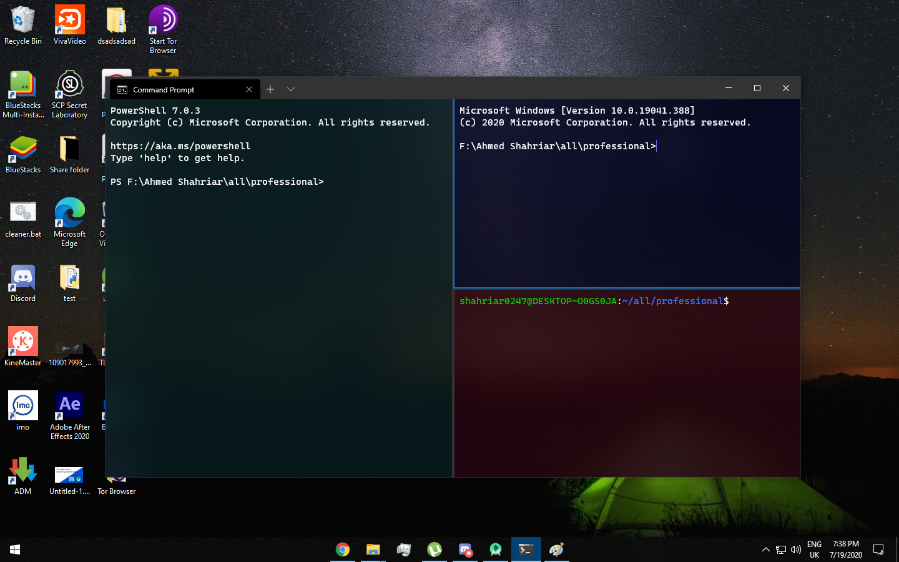

# windows-terminal-theme

<h3> Description </h3>

My favourite themes of Windows Terminal 

<h3> Installation </h3>
<ol>
  <li>First open terminal and go to drop down and go to settings </li>
  <li>Choose any folder (theme) and go to my "settings.json" file and replace the whole code with yours</li>
  <li>Download the "terminal.bat" file (or copy paste the code after creating a bat file) and run it </li> 
</ol>

<h3>Themes</h3>
<ol> <li> <h4> 3 split pwsh, cmd and ubuntu </h4> 
Requirements: New powershell or it wont work. <a href="https://github.com/microsoft/terminal/releases"> Download </a>  </li> </ol>
<h3> Updates </h3>
<h4> July 19, 2020 </h4>

 I just added my first theme, 3 split pwsh, cmd and ubuntu with customized color scehems 

