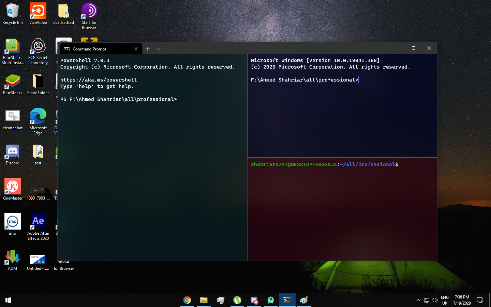

# windows-terminal-theme

<h3>Description</h3>
<p>Using Windows Terminal my way</p>

<h2> How to use [1] </h2>
<h3>Installation</h3>
<ol>
  <li>First open terminal and go to drop down and go to settings </li>
  <li>Choose any folder (theme) and go to my "settings.json" file and replace the whole code with yours</li>
  <li>Download the "terminal.bat" file (or copy paste the code after creating a bat file) and run it </li> 
</ol>

<h3>Themes</h3>
<ol> <li> <h4> 3 split pwsh, cmd and ubuntu </h4> <p>Requirements: New powershell.<a href="https://github.com/microsoft/terminal/releases"> Download </a><br><br>  </li> </ol>
<h3> Updates </h3>
<h4> July 19, 2020 </h4>
<p> I just added my first theme, 3 split pwsh, cmd and ubuntu with customized color scehems </p>

<h2> How to use [2] </h2>
<h3>Installation</h3>
<ol>
  <li>Install oh-my-posh</li>
  <li>Install Terminal-Icons</li>
  <li>Set this theme file as the default theme</li> 
</ol>

<h3>My $PROFILE</h3>

```
Import-Module oh-my-posh
oh-my-posh --init --shell pwsh --config ~/fancy_frost.omp.json | Invoke-Expression
Import-Module Terminal-Icons
```

<h3>Preview</h3>

